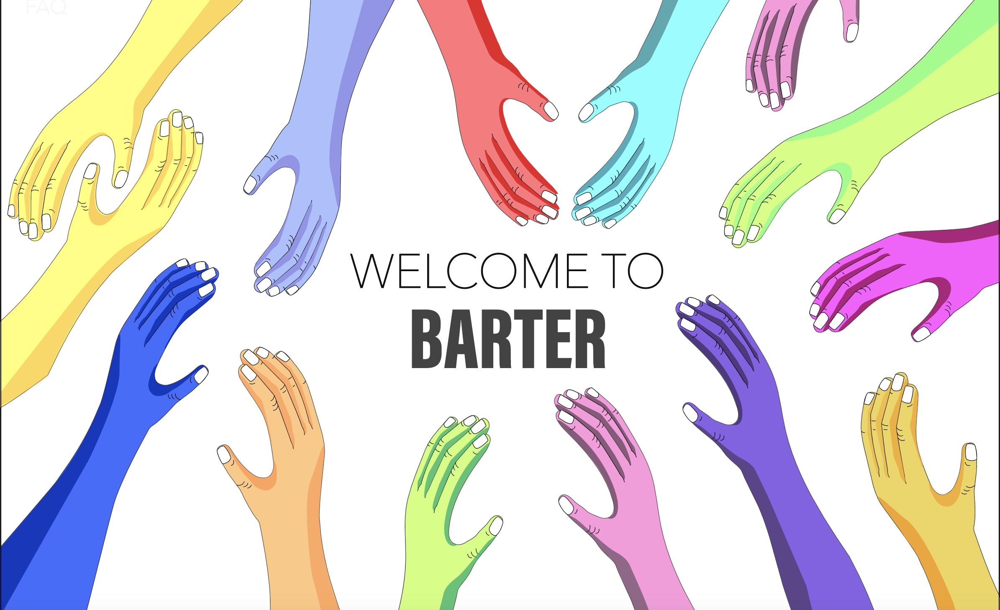
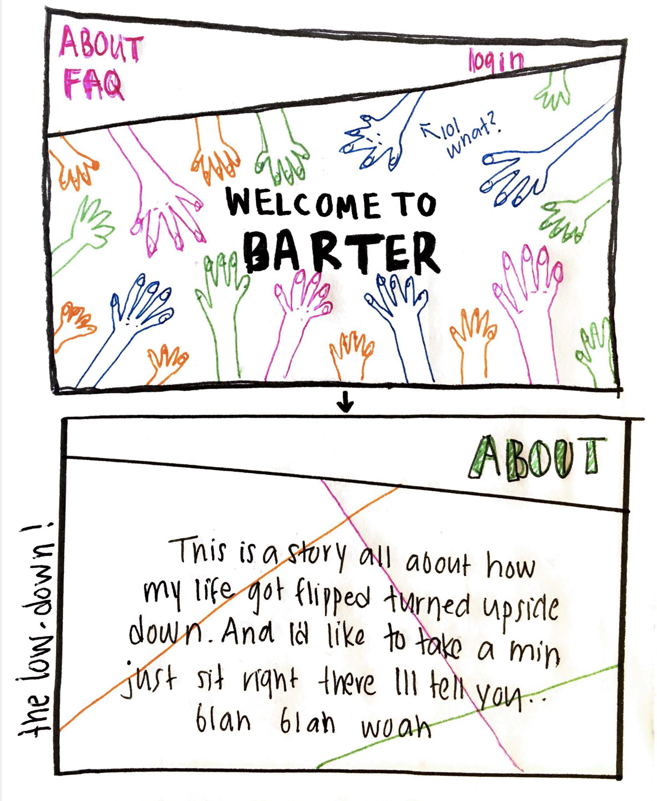
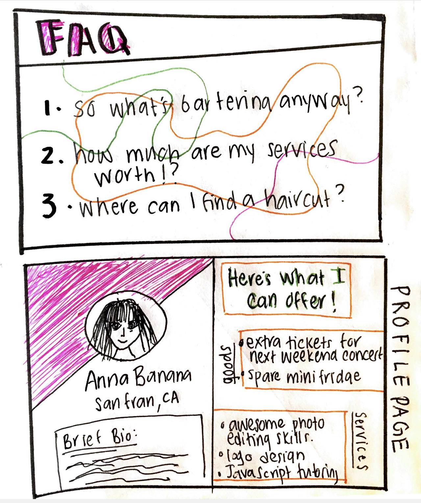
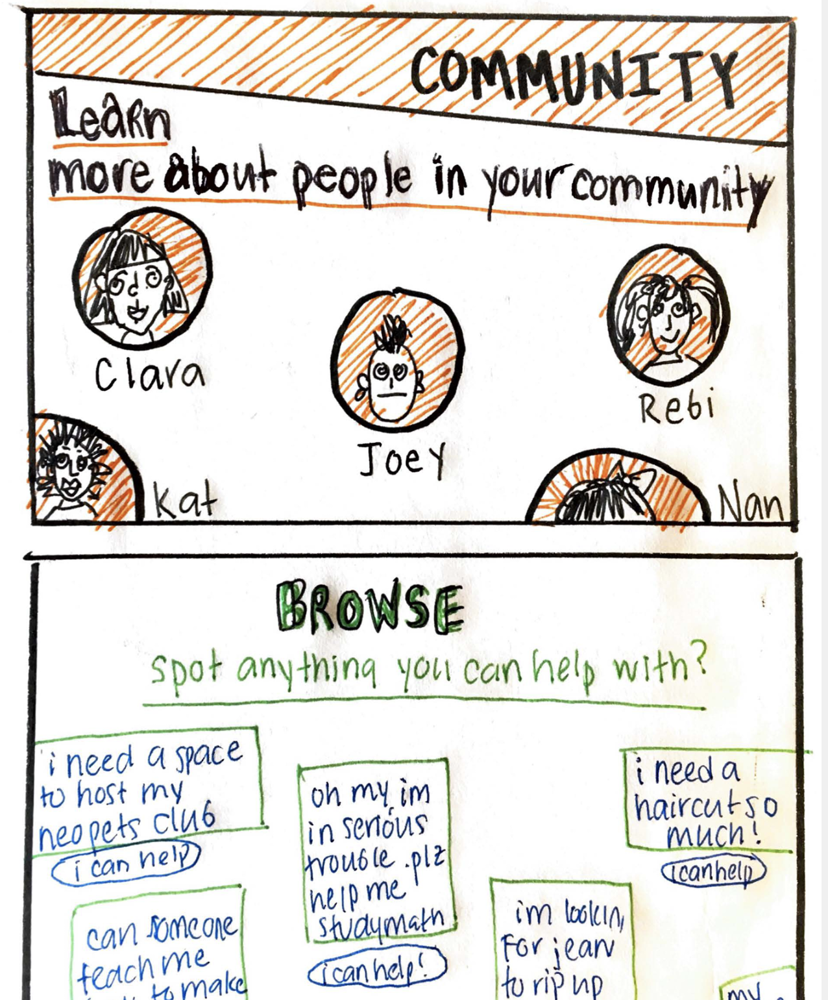
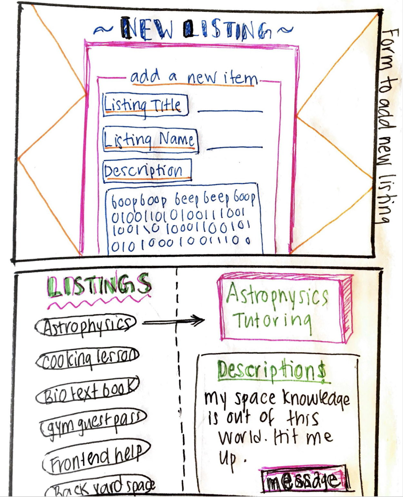
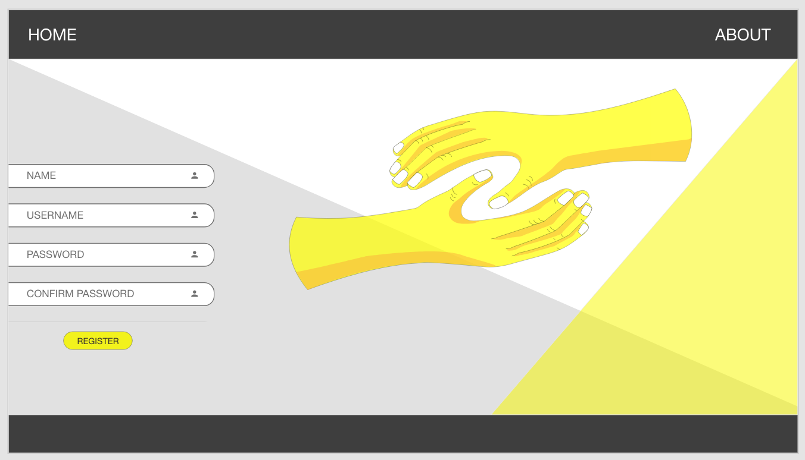

# BARTER 
Barter is an online platform that facilitates the exchange of goods and services for other goods and services (without money!) It's an interactive and inclusive space where people can post their own "listings" or browse the listings that have already been published. Users can mesage eachother if they're interested in making a swap. From there, they set the parameters of their exhange and that's it! 

 ## Why Barter?
As a student with low purchasing power, I'm particularly interested in the concept of a barter economy. Swapping goods and services is a great way to save money. Bartering is also a neat way to get to know your peers/neighbors/collegues and build a strong sense of community. People barter all the time, without considering it as such. For example, you might help your friend move into their new place with the expectation that they'll offer their help when you need it. There is a more balanced and symmetrical type of reciprocity, however, that involves the direct and instant exchange of customary equivalents. I wanted to create an organized space that would promote these kinds of exchages. Imaging getting a sneak peek of what the people around you can offer. Maybe you've been paying $80 to get your haircut, but the guy downstairs can cut your hair in exchage for your extra ticket to Friday's comedy show. 

**Want to Learn More About Barter?**
[Check out My Medium Post](https://uxdesign.cc/bringbarterback-72b530ba1c59)

# Wireframes
Take a look at my very first paper prototypes. 

### Adobe Xd
I'm working with Adobe Xd to create more polished wireframes.
Here's an example of a basic login page I created.

